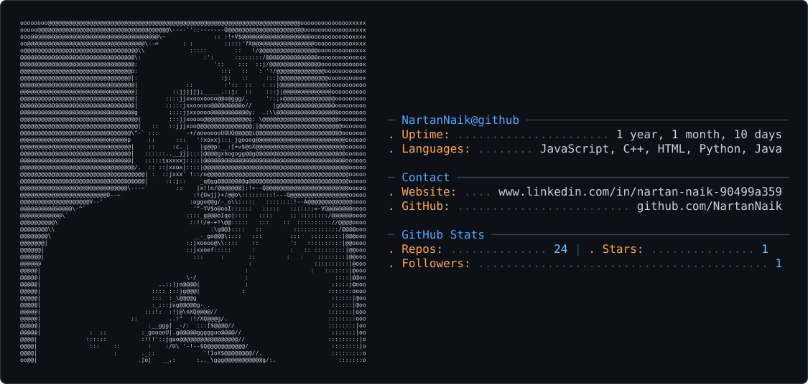

<picture>
  <source media="(prefers-color-scheme: dark)" srcset="dark_mode.svg" />
  <source media="(prefers-color-scheme: light)" srcset="light_mode.svg" />
  
</picture>
<h1 align="center">Nartan Maruti Naik</h1>
<h3 align="center">Computer Science Engineering Undergraduate — Full-Stack & AI-Integrated Systems</h3>

  
  

  
  
  

  Building AI-integrated web and mobile platforms with React, Node.js, Flutter, and LLM APIs (Gemini, Clarifai, Hugging Face).
  Passionate about production-grade systems that combine solid backend architecture with practical AI automation.

 

## About

<table>
<tr>
<td width="50%" valign="top">

**Education**
- B.E. Computer Science & Engineering — The National Institute of Engineering, Mysuru (2024 – 2027)
- Diploma, Automobile Engineering — R N Shetty Rural Polytechnic, Murdeshwar (2021 – 2024)

**Coursework**: Data Structures, Algorithms, OOP, Operating Systems, DBMS, Computer Networks

</td>
<td width="50%" valign="top">

**Currently Building**
- Multimodal AI ingestion pipelines on serverless infrastructure
- AI-assisted codebase documentation tooling
- Real-time, role-based full-stack platforms

**Currently Learning**
- Supervised Machine Learning: Regression & Classification — DeepLearning.AI

</td>
</tr>
</table>

## Tech Stack

  

  

  

  

<table>
<tr><td><strong>Languages</strong></td><td>C++, Python, JavaScript, SQL</td></tr>
<tr><td><strong>Frameworks</strong></td><td>React, Node.js, Express.js, FastAPI, Flutter</td></tr>
<tr><td><strong>Cloud & Databases</strong></td><td>MongoDB, Firebase, Supabase (PostgreSQL)</td></tr>
<tr><td><strong>Concepts</strong></td><td>DSA, OOP, REST APIs, JWT Auth, Socket.IO, LLM Integration</td></tr>
<tr><td><strong>Tools</strong></td><td>Git, GitHub, VS Code, Android Studio, IntelliJ, Eclipse</td></tr>
</table>

## Featured Projects

### CreatorLens AI
**Multimodal Social Ingestion & Serverless Scraping Pipeline**
 
     

- Flutter app that intercepts native Instagram share intents to ingest media URLs into a cloud pipeline
- Fault-tolerant Node.js backend on Vercel serverless functions, using a two-step asynchronous relay to bypass 10-second execution timeouts
- Gemini Vision AI analyzes thumbnails and captions to extract creator demographics and niche categorization
- Dynamic AI model discovery, automated API key rotation, and an in-memory Bloom Filter for zero-latency duplicate rejection
- React staging/moderation dashboard with sequential auto-queue processing and Firestore sync optimizations

---

### Unpack
**AI Codebase Analysis & Documentation Platform**
 
    

- Ingests codebases via directory upload, ZIP archive, or GitHub URL
- Uses Google Gemini to auto-generate architectural breakdowns, project summaries, and technical documentation
- FastAPI + GitPython backend with a Supabase (PostgreSQL) data layer, supporting multi-format exports (PPTX, Markdown)
- File-structure cleaning to improve documentation accuracy and reduce token usage

---

### Smart Food Management & AI-Driven Freshness System
 
   

- Role-based platform (users & farmers) with JWT authentication and an Express.js API layer
- Lifecycle-aware, soft-delete food data model driven by a daily cron job that auto-detects expiring items
- Clarifai integration for food image recognition and a Hugging Face model for farmer-facing reuse suggestions
- Real-time donation chat via hybrid REST + Socket.IO architecture with MongoDB aggregation pipelines for waste analytics

## Coursework & Certifications

- Supervised Machine Learning: Regression and Classification — DeepLearning.AI
- Introduction to Software Engineering
- Data Structures in C
- Algorithms, Data Collection, and Starting to Code
- The Bits and Bytes of Computer Networking
- Introduction to Git and GitHub
- Hashgraph Developer Course

## GitHub Activity

  
  

  

  <em>Learning by building, one production-grade system at a time.</em>

